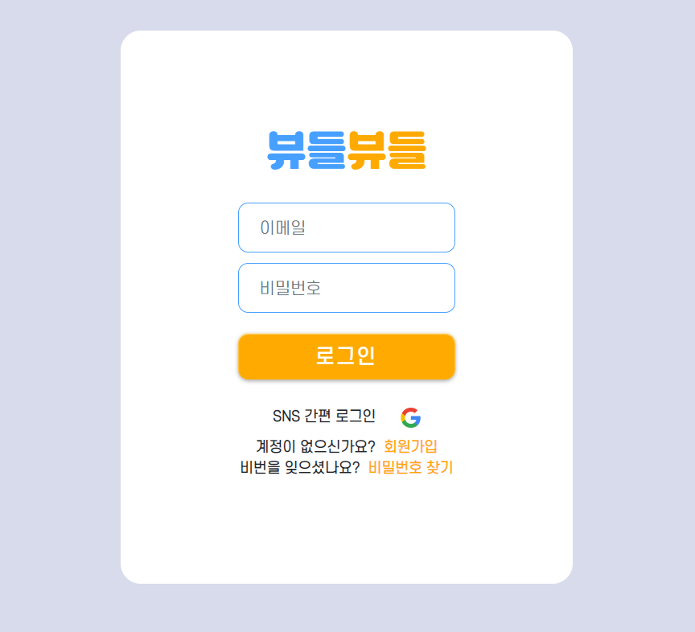

# Ⅰ. 서비스 소개

## 1. 서비스 설명

### 개요

- 한줄 소개 : 효율적이고 유쾌한 면접 준비를 위한 `화상 면접 스터디` 서비스
- 서비스 명 : 뷰들뷰들(viewdle viewdle : Inter`view` + `부들`부들)

### 타겟

- 쉽고 빠르게 면접에 대한 피드백을 정리하고 싶은 사람들
- 처음 겪어보는 면접 준비에 어려움을 겪는 사람들

## 2. 기획 배경

### 배경

많은 사람들이 면접 준비를 위해 면접 스티디를 구하지만, 스터디를 진행하다보면 종종 불편함을 느끼곤 합니다.

첫번째는 `피드백 정리`입니다. 시간이 지나면 어떤 상황에서 왜 이런 피드백을 받았는지 기억하는 것은 쉽지 않습니다. 이런 문제를 해결하기 위해 따로 녹화를 진행하기도 하지만, 결국에는 녹화했던 영상들과 그때 받았던 피드백들을 계속해서 관리해야한다는 번거로움이 있습니다.

두번째는 면접 준비에 대한 `두려움`입니다.  면접 준비를 처음하는 사람들은 면접에 대해 많은 두려움과 긴장감을 느끼곤 합니다. 스터디를 잘 진행해보려 하지만 입이 쉽게 떨어지지 않습니다.

`뷰들뷰들`은 이러한 면접 준비에 대한 어려움이 있는 사람들이 좀 더 효율적이고 유쾌한 면접 준비를 할 수 있도록 하자는 취지에서 시작되었습니다.

### 목적

**면접을 준비하는 사람들이 `조금 더 편하고 즐겁게 면접 준비`를 할 수 있게 하자**

## 3. 서비스 화면

순서대로 로그인페이지, 메인페이지, 회원정보 열람 및 수정페이지, 다시보기 페이지 그리고 시연영상 입니다

1. 로그인 페이지

   

2. 메인페이지

   

3. 회원정보 열람 및 수정페이지

   

4. 다시보기 페이지

   

## 4. UCC 영상

<video src="./exec/5.README/UCC.mp4?raw=true"></video>

# **Ⅱ. 기술스택**

### 1. WebRTC & OpenVidu

### **[WebRTC](https://webrtc.org/)**

Media Source: https://medium.com/dvt-engineering/introduction-to-webrtc-cad0c6900b8e

> **WebRTC**(Web Real-Time Communication)은 웹 애플리케이션과 사이트가 중간자 없이 `브라우저 간`에 `오디오나 영상 미디어`를 포착하고 마음대로 `스트림`할 뿐 아니라, 임의의 데이터도 `교환`할 수 있도록 하는 기술입니다. WebRTC를 구성하는 일련의 표준들은 플러그인이나 제 3자 소프트웨어 설치 없이 종단 간 데이터 공유와 화상 회의를 가능하게 합니다. - [mdn web docs](https://developer.mozilla.org/ko/docs/Web/API/WebRTC_API)

### **[OpenVidu](https://openvidu.io/)**

> OpenVidu는 복잡한 WebRTC 기술을 보다 쉽게 이용할 수 있게 해줍니다.

[openvidu-insecure-vue](https://docs.openvidu.io/en/stable/tutorials/openvidu-insecure-vue/) 를 통해 기본적인 동작원리를 이해했고, 이를 본 프로젝트에 적용했습니다.

### 2. API

### [Web Speech API](notion://www.notion.so/[])

> Web Speech API를 통해 사용자의 음성 데이터를 웹 어플리케이션에 통합할 수 있습니다. Web Speech API는 SpeechSynthesis(텍스트 음성 변환) 및 SpeechRecognition(비동기 음성 인식)의 두 부분으로 구성됩니다.

Web Speech API는 크롬 브라우저에서만 사용한 API로 높은 인식률과 빠른 반응성을 보입니다. 특별한 import 없이도 길지 않은 코드로 바로 사용할 수 있습니다. 뷰들뷰들은 해당 기능을 플레이 모드의 `필터를 씌우기 위한 음성 인식`에서 사용했습니다.

### 3. Teachable Machine

> Teachable Machine은 누구나 머신러닝 모델을 쉽고 빠르고 간단하게 만들 수 있도록 제작된 웹 기반 도구입니다

.머신러닝 코드를 작성하지 않고도 컴퓨터가 이미지, 사운드, 포즈를 인식하도록 컴퓨터를 학습시킬 수 있습니다. Teachable Machine을 이용해 학습 시킨 모델을 내보내 프로젝트에서 사용할 수 있습니다. 뷰들뷰들은 해당 기능을 `**면접자 자세 평가 기능**에서 사용했습니다.

# **Ⅲ. 면접스터디 서비스 소개**

뷰들뷰들에서는 사용자들을 위해 `스터디 모드`와 `플레이 모드`를 제공하고 있습니다.

1. `스터디 모드` : `실제 면접`을 준비하기 위한 서비스

   1. **면접자 지정** 기능

      - 뷰들뷰들에서는 방장이 면접자를 지정할 수 있는 기능을 제공합니다. 면접실에 입장하기 전 **대기실에서 방장이 면접자를 지정**하고 면접 시작 버튼을 누르면 면접이 시작됩니다.

        

   2. **면접 영상 저장** 및 피드백 **타임라인 기능**

      - 뷰들뷰들에서는 사용자들이 영상과 피드백들을 손쉽게 저장하고 확인할 수 있는 기능을 제공합니다.

      - 면접자 역할로 참여한 사용자는 면접실에서 자신의 화면을 제외한 면접관들의 화면만을 확인할 수 있습니다.

        

      - 면접관 역할로 참여한 사용자들은 **실시간으로 면접자의 영상을 보며 피드백**을 남길 수 있습니다. 이때, 면접관들에게는 면접자의 화면은 크게, 면접관들의 화면은 작게 제공됩니다.

        방장이 면접을 시작할 시 화면 녹화가 진행되며, 면접을 종료할 시에 **화면 녹화를 종료하고 서버에 저장**합니다.

      - 이후, 면접이 끝난 후, 면접관은 **피드백실로 이동**하며, 방금 진행한 면접 영상을 보며 피드백을 수정할 수 있는 시간(5분)이 제공됩니다. 이때, 작성된 피드백의 재생 버튼을 클릭하면 **면접 영상은 피드백이 작성된 시점으로 이동**합니다.

        

      - 모든 면접관의 피드백 수정이 완료되면 녹화 영상과 피드백들은 **면접자에게 저장**됩니다. 다시보기 기능에서도 피드백이 작성된 시점으로 동영상을 이동해 확인할 수 있습니다.

   3. Teachable machine을 이용한 **면접자 자세 평가 기능**

      - 자세 평가 기능은 앞서 설명했던 **teachable machine을 사용**합니다.

      - teachable machine을 통해 자세의 좌우 기울어짐 정도와 카메라에서 떨어진 정도를 학습시켜 모델을 만든 후, 이를 **저장된 면접 영상과 연결**하여 사용합니다.

      - 사용자는 면접 이후 저장된 본인의 면접 영상에서 **자세 평가를 할 영역을 드래그**하여 사용할 수 있습니다.

        

      - 해당 기능을 통해, 사용자는 자신이 면접을 진행한 후, 화면에 너무 가깝거나, 멀리 있는지, 혹은 한쪽으로 기울어져 있는지를 확인할 수 있습니다.

   4. 기타 기능

      - 뷰들뷰들에서는 원활한 면접 스터디를 위해 입장 전 면접에 필요한 자기소개서를 선택할 수 있는 기능을 제공합니다.

      - 방장에 의해 면접자로 지정되면 면접관들은 면접 진행 시에 **면접자의 자기소개서를 새 창에서 확인**할 수 있습니다.

        

      - **면접자는** 면접이 끝난 후 **새로 지정**할 수 있습니다.

2. `플레이 모드` : 면접에 대한 `유쾌한 경험` 제공

   1. **키워드 인식**을 통한 FaceOverlay 기능

      - 뷰들뷰들에서는 **Web speech api**를 통해 면접자가 빵, 감자, 나안해 라는 **키워드**를 말하는지 **확인**하고, 이에 해당되는 **필터를 면접관에게 씌우는 기능**을 제공합니다.

        - 이는 면접자가 면접관을 무섭지 않고, **친근한 이미지로 인식**할 수 있도록 도움을 주는 기능입니다.

      - 면접자가 **빵** 이라는 키워드를 외칠 시에는 면접관의 얼굴에 **빵** 이미지를 Overlay 합니다.

        

      - 면접자가 **감자**라는 키워드를 외칠 시에는 면접관의 얼굴에 **감자** 이미지를 Overlay 합니다.

        

      - 면접자가 **나 안해**라는 키워드를 외칠 시에는 면접관의 얼굴에 **대머리** 이미지를 Overlay 합니다.

        

   2. **돌발 질문 기능**

      - 뷰들뷰들은 면접관에게 면접자에게 **제한시간 내에 답변**을 유도할 수 있게하는 **돌발 질문 기능**을 제공합니다.

        - 해당 기능을 통해 면접관은 중요한 질문임을 면접자에게 알릴 수 있으며, 면접관은 낯선 상황에서도 당황하지 않는 능력을 기를 수 있습니다.

      - 면접관 중 한 명이 돌발 질문 기능을 클릭할 시, 해당 면접관 및 다른 면접관들의 돌발 질문 및 돌발 상황 버튼이 **비활성화** 됩니다.

        

      - 면접자에게는 3초간 **배경화면 전환을 제공**하여, 돌발 질문 기능이 실행되었음을 알려줍니다.

        

      - 3초 후 돌발 질문 버튼을 누른 면접관에게 적합한 답변이었는지를 응답하도록 합니다.

      - 면접관이 답변을 완료하면 면접관들의 돌발 질문 및 돌발 상황 버튼이 활성화됩니다.

   3. **돌발 상황 기능**

      - 뷰들뷰들은 면접관에게 면접자에게 불시에 게임을 진행하도록하는 **돌발 상황 기능을 제공**합니다.

        - 해당 기능을 통해 면접자는 임기응변 능력 및 집중력을 기를 수 있습니다.

      - 면접관 중 한 명이 돌발 상황 버튼을 클릭할 시, 해당 면접관 및 다른 면접관들의 돌발 질문 및 돌발 상황 버튼이 비활성화됩니다.

      - 면접자에게는 게임 화면을 제공합니다

        - 1 to 9 게임

          - 제한 시간 내에 1부터 9까지의 숫자를 클릭하도록 하는 게임입니다.

            

        - 방향키 게임

          - 제한 시간 내에 화면에 표시되는 방향키를 순차적으로 누르는 게임입니다.

            

        - 연타 게임

          - 제한 시간 내에 스페이스바를 연타해 화면에 차오르는 물을 제거하는 게임입니다.

            

      - 면접자가 게임을 성공하거나, 제한시간이 지나게 되면 면접관들의 돌발 질문 및 돌발 상황 버튼이 활성화됩니다.

   4. 면접자 **쫓아내기 기능**

      - 면접자가 돌발 질문에 올바른 대답을 하지 못하거나, 돌발 상황에 적절한 대처를 하지 못했을 시 면접자 화면 왼쪽에 표시되는 게이지가 채워지게 됩니다.
      - **게이지가 다 채워질 시**(5회) 면접자와 면접관들은 **대기실**로 돌아오게 됩니다.

      

# **Ⅳ. 프로젝트 진행**

1. Notion

모든 작업의 시작은 노션에서 시작했습니다. api 명세, 기능명세등 공통으로 해당되는 부분이외에도 Backend, Frontend 담당자들 만의 정보도 notion에 기록하여 1차적으로 정보를 얻을 수 있도록하여 불필요한 시간낭비를 줄이도록 하였습니다.

작업도중 유익한 정보를 찾았을 때 다같이 공유하도록 참고 자료 페이지도 따로 만들어 공유하였습니다.

b. JIRA

매일 아침 저녁으로 데일리 스크럼을 진행하여 자신이 해야할 일과 한 일을 팀원들과 공유하고 지라를 업데이트 하였습니다. 매주 계획과 다르게 흘러간 이슈들은 최신화하여 관리해 주었습니다.

1. 에픽은 네이게이션바, 뱃지관리, 영상관리, 이용추이, WebRTC, 자소서관리, 회원관리등 기능별로 나누어주었습니다.

2. 스토리는 에픽과 태스크를 좀 더 상세히 기록하는 방법을 선택하여 작성하지 않았습니다.

3. 태스크는 해당 에픽에 넣어 기능별로 관리하였습니다. 스토리포인트와 담당자를 설정하여 구분을 명확하게 하였습니다.

4. 번다운차트

   1. 1주차

   

   b. 2주차

   

   c. 3주차

   

c. GIT

git에 익숙치 않은 팀원들을 위해 Git 참고자료 전용 notion페이지를 따로 구성하여 모두 꼬임없이 git을 사용할 수 있도록 노력하였습니다.

또한 우리 팀만의 깃 규칙을 정하여 커밋 메세지와 브랜치관리를 더욱 간결하고 가독성 있게 관리였습니다.

## **Ⅴ. UI / UX 및 시스템 아키텍쳐**

### **1. 와이어프레임**

### **2. 목업**

[피그마](https://www.figma.com/file/DriTnARX1bgGvN2hvFw9vw/SSAFY-공통프로젝트(뷰들뷰들)?node-id=0%3A1)를 통해 추가적인 페이지, 페이지 내/외 동작, 기타 화면 기획 중 회의 내역 등을 확인하실 수 있습니다.

### 3. 시스템 아키택쳐

# **Ⅳ. 소감**

박채림 : 프로젝트 기획부터 일정관리, 깃, 배포까지! 전에 쉽게 해보지 못했던 것들을 직접 해보고 많이 배울 수 있었던 프로젝트였습니다. 그 과정에서 많은 어려움이 있었지만.. 5명의 팀원들이 모두 적극적으로 참여해줬기에 좋은 결과물이 나왔던것같습니다. 모두 고마워요 :blossom:

가수왕: 처음에는 백엔드 포지션으로 프로젝트에 참여했지만 하다 보니 프론트엔드, 서버까지 하고 있더군요. 덕분에 다양한 경험을 할 수 있었고 실제 웹 어플리케이션이 배포되었을 때, 어떤 흐름으로 동작하는지 잘 이해할 수 있었습니다. 또한 각자 팀원들이 자기의 포지션에서 자기의 방식대로 최선을 다해 노력하는 모습을 보면서 많은 것을 배울 수 있었습니다. 다들 고생하셨고, 고맙습니다.

이병헌: 처음으로 팀 단위 개발 프로젝트에 FE로 참여했습니다. 7주간의 시간 동안 서비스 기획부터 시작해 이에 기반한 일정 수립, 개발 환경 및 컨밴션 설정, git과 jira를 활용한 이슈 관리, 개발, 버그 수정, 작업물 발표의 과정을 거쳤습니다. 새로운 기술인 webRTC를 공부해 적용했으며 기존에 사용하던 Vue를 활용해 구현했습니다. 프로젝트를 기획 단계에서 구상한 것처럼 완성했다는 점에서 감격스럽고, 이를 위해 노력해 준 팀원들에게 감사합니다. 다음에는 기획 단계에서 기능을 더 구체적으로 명시해 시행착오를 줄여 프로젝트의 완성도를 높이고 싶습니다.

김이랑 : 프로젝트 시작 즈음에 팀장 자리가 공석이 되어 팀장을 맡아보았는데, 덕분에 프로젝트 전반에 대해 많이 이해를 할 수 있었습니다. 프로젝트 개발 일정 외에도, 싸피에서 진행하는 특강이나 인프라 조성, 학습 등에 대한 시간을 고려해 일정관리를 했으면 어땠을까 하는 아쉬움이 남기도 하지만, 팀원들 모두 열정을 가지고 개발을 진행하고, 원활하게 의사소통해 준 덕분에 구현하고자 한 기능들을 모두 구현할 수 있었습니다. 새롭게 진행되는 프로젝트에서는 뷰들뷰들팀 구성원 + a로 전국 1등까지 노려보고 싶습니다 😀.

임현탁 : 여태 내가 했던 프로젝트는 많아 봤자 팀원이 3명이었습니다. 이번 프로젝트로 정말 팀프로젝트라는 것이 무엇인지 느낄 수 있었습니다.  처음엔 6명으로 시작하였지만 본격 프로젝트 시작 전 본팀장님이 부득이한 개인사정으로 빠지게 되어 팀장을 새로 뽑으며 불안하게 출발하였습니다. 하지만 남은 5명 모두 케미가 엄청 좋았던것 같고 서로 요구하는 것을 불만없이 들어주는 배려심이 있었던 것 같습니다. 막막하게만 느껴졌던 프로젝트가 5명에서 합심하여 진행해 결과물을 만들어 낼수 있어 너무나 보람찼습니다.
